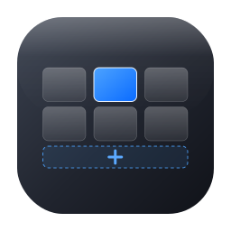
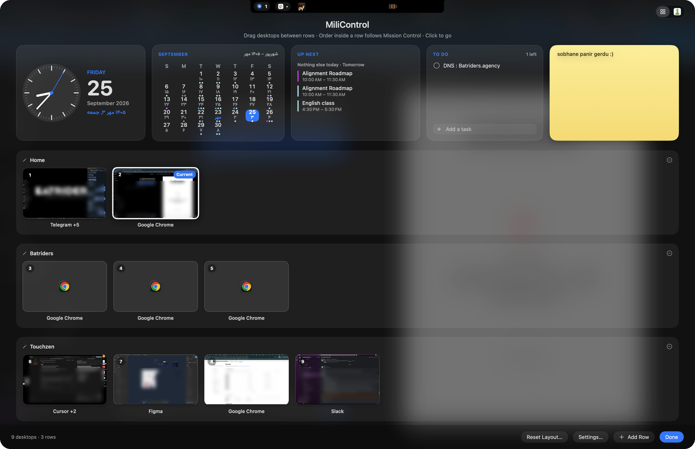

<div align="center">



# MiliControl

**Your Mac's desktops, arranged in rows.**<br>
Move through them with native macOS slides — plus a calm dashboard, a living notch, and your favourite sites, one shortcut away.

[](https://github.com/MiliIdea/MiliControl/releases/latest)


<br>



<sub>The grid view — <kbd>⌃</kbd> <kbd>↑</kbd></sub>

</div>

<br>

## Why MiliControl

macOS lines your desktops up in one long strip. MiliControl lets you group
them into **rows** — *Home*, *Work*, *Side project* — and move around that
grid with the keyboard. Every move is macOS's **own** slide: MiliControl
decides *where* to go, macOS does the switch.

```
Home        [1] [2]
Batriders   [3] [4] [5]
Touchzen    [6] [7] [8] [9]
```

## What's inside

<table>
<tr>
<td width="50%" valign="top">

### Grid navigation
**⌃⌥ ← →** moves within a row, **⌃⌥ ↑ ↓** between rows. Tap to slide
instantly; hold the arrow to see the whole grid and jump anywhere in one
slide. Four-finger swipes work too.

</td>
<td width="50%" valign="top">

### The grid view
Every desktop — and every fullscreen app — as a live preview, with browser
profiles ("Chrome · Work") on each tile. Drag desktops between rows, name
your rows, click to go.

</td>
</tr>
<tr>
<td valign="top">

### Dashboard
Clock, a month calendar with your events (hover a day to see them), up next,
a to-do list and a sticky note. Add a **second calendar** — Persian (Shamsi),
Hijri, Hebrew and more — shown right beside the Gregorian date.

</td>
<td valign="top">

### A living notch
When Spotify or Apple Music plays, the notch widens with the artwork and a
little wave. Hover for the full player. New Telegram, WhatsApp and Slack
messages drop down from it too.

</td>
</tr>
<tr>
<td valign="top">

### Web tabs
Keep chess.com, YouTube, ChatGPT — any site — one click away inside the grid
view. Pages stay exactly where you left them.

</td>
<td valign="top">

### Light and native
A menu-bar app with no Dock icon. Per-desktop Dock visibility, launch at
login, and automatic updates. Everything stays on your Mac.

</td>
</tr>
</table>

## Get started

1. **[Download the latest DMG](https://github.com/MiliIdea/MiliControl/releases/latest)**, open it and drag MiliControl onto **Applications**.
2. Open MiliControl. Its **Settings** window shows a short setup checklist — follow it until everything is green (Accessibility, and a couple of Mission Control shortcuts).
3. Press **⌃↑** to open the grid view and arrange your rows.

MiliControl updates itself from then on (Settings ▸ Updates).

## Shortcuts

| Keys | What it does |
|---|---|
| <kbd>⌃</kbd><kbd>⌥</kbd> <kbd>←</kbd> <kbd>→</kbd> | Previous / next desktop in the current row |
| <kbd>⌃</kbd><kbd>⌥</kbd> <kbd>↑</kbd> <kbd>↓</kbd> | Previous / next row |
| Hold the arrow | Show the grid · tap arrows to choose · release <kbd>⌃</kbd><kbd>⌥</kbd> to go |
| <kbd>⌃</kbd><kbd>↑</kbd> (or <kbd>⌃</kbd><kbd>⌥</kbd><kbd>Space</kbd>) | Open the grid view |
| <kbd>⌃</kbd><kbd>↓</kbd> or <kbd>Esc</kbd> | Close the grid view |

## Good to know

- **Up to 16 desktops** — macOS's own limit. Desktops 1–9 switch in one slide
  out of the box; 10–16 need a shortcut each for that (Settings walks you
  through it), and still work without one in a few slides.
- **Order inside a row follows Mission Control**, so every slide goes the way
  you move. Reorder desktops in Mission Control's top bar and the grid follows.
- **Fullscreen apps** have tiles too (⤢). When an app leaves fullscreen, its
  tile waits in its slot for next time.
- **Privacy.** MiliControl never sends anything anywhere. Calendar access is
  optional; previews and messages are read on your Mac and kept in memory.
- **Why not the App Store?** MiliControl needs system access the App Store
  doesn't allow. It's signed with a Developer ID and notarized by Apple.

## Build from source

Requires Xcode 15+ on macOS 13+.

```bash
git clone https://github.com/MiliIdea/MiliControl.git
cd MiliControl
open MiliControl.xcodeproj      # ⌘R builds and installs to /Applications
```

```bash
swift test                               # grid + navigation rules
python3 Scripts/generate_project.py .    # regenerate the Xcode project after adding files
```

Each build installs to **/Applications/MiliControl.app** so the Accessibility
permission keeps working (install log: `/tmp/MiliControl-install.log`).
Logs are in Console.app under the subsystem `com.mili.MiliControl`.

| Layer | Where |
|---|---|
| Rules (pure, tested) | `Core/` — grid layout, navigation, route planning |
| macOS integration | `System/` — spaces, shortcuts, switching, setup checks, media, messages |
| Features | `Features/` — navigation & HUD, grid view, dashboard, notch, web tabs, settings, updates |

Publishing a release: see [docs/RELEASING.md](docs/RELEASING.md).

## Credits

[Sparkle](https://sparkle-project.org) for updates ·
[Vazirmatn](https://github.com/rastikerdar/vazirmatn) by Saber Rastikerdar for
Persian text (SIL Open Font License).

<div align="center">
<br>
<sub>Made with care by <a href="https://github.com/MiliIdea">Milad Karimi</a></sub>
</div>
